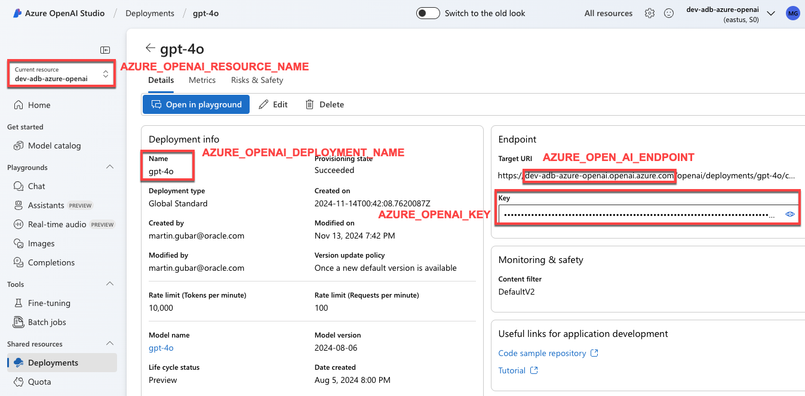

# Oracle Database@Azure: Sample SQL Scripts
Numerous SQL scripts are available to help you get started using Autonomous Database on Oracle Database@Azure

Prerequisites:
* [Create an Autonomous Database](../azure-cli/create-adb.md)
* A VM deployed on the same VCN as Autonomous Database (or on a network that can access your Autonomous Database)
* Use these great VS Code extensions that help you develop and debug your database apps:
    * SQL Developer for VS Code ([Learn More](https://www.oracle.com/database/sqldeveloper/vscode/) | [Marketplace](https://marketplace.visualstudio.com/items?itemName=Oracle.sql-developer))
    * Oracle Developer Tools for VS Code  ([Learn More](https://docs.oracle.com/en/database/oracle/developer-tools-for-vscode/getting-started/gettingstarted.html) | [Marketplace](https://marketplace.visualstudio.com/items?itemName=Oracle.oracledevtools)) 

## Connect to Autonomous Database
There are [numerous client tools](../azure-cli/create-adb.md#whats-next) that you can use to start working with Autonomous Database. This includes the built-in SQL Worksheet that's part of the Database Tools (and available from the linked OCI Console) or a tool like VS Code and one an Oracle Database extension.

## Sample scripts
Try out these scripts to learn how to get started using Autonomous Database. Simply update the [`config.sql`](#configuration-file) script prior to running the samples:

|Script|Description|
|----|---|
|[data-create-sample-schema.sql](data-create-sample-schema.sql)|Create a sample user and install sample data|
|[data-create-synthetic-data.sql](data-create-synthetic-data.sql)|Use AI to generate sample data sets|
|[data-import-from-datalake.sql](data-create-synthetic-data.sql)|Import sample data from Azure Data Lake. Sample data was uploaded using the [`create-all-resources.sh`](../azure-cli/create-all-resources.sh)and [`create-data-lake-storage.sh`](../azure-cli/create-data-lake-storage.sh) scripts. You can run [`show-data-lake-storage-info.sh`](../azure-cli/show-data-lake-storage-info.sh) to get connection information to the storage container.|
|[data-export-to-datalake.sql](data-export-to-datalake.sql)|Export data from a table to your data lake storage|
|[select-ai-admin-enable.sql](select-ai-admin-enable.sql)|Autonomous Database is secure by default. In order to access external services, you will need to enable connectivity. This script enables connectivity to your Azure OpenAI resource.|
|[select-ai-create-profile.sql](select-ai-create-profile.sql)|A Select AI profile is used to connect to your AI provider. It includes information about your provider plus tables and view that you want to be targets for natural language queries|
|[select-ai-nl2sql.sql](select-ai-nl2sql.sql)|Use natural language to query your data|
|[select-ai-sql-function.sql](select-ai-sql-function.sql)|Use Select AI SQL functions to apply AI to your data. These examples summarize a support chat and make product recommendations based on info in your database|
|[select-ai-rag.sql](select-ai-rag.sql)|Select AI makes it easy to create AI vector pipelines and then ask questions using AI and your organization's knowledge base|


### Configuration file
Many of the SQL scripts rely on information found in your [config.sql](config.sql) file. Update the config file prior to running any of the scripts. 

>**IMPORTANT:** This file will contain sensitive data that should be protected. Set the file's permissions so that only the file's owner can view its contents:
```bash
chmod 600 config.sql
```

|Setting|Description|Example|
|----|----|----|
|CONN|JDBC Connection. [Go here](../azure-cli/create-adb.md#jdbc-example) to see how to get the connection details.|jdbc:oracle:thin:@(description= (retry_count=20)(retry_delay=3)(address=(protocol=tcps)(port=1521)(host=your-host.oraclecloud.com))(connect_data=(service_name=my_quickstart_medium.adb.oraclecloud.com))(security=(ssl_server_dn_match=no)))
|USER_NAME|Database user that will contain sample data|'moviestream'|
|USER_PASSWORD|Password for the sample database user|'watchS0meMovies#'
|**Select AI and GenAI**|
|AZURE_OPENAI_RESOURCE_NAME|Name of the Azure OpenAI endpoint|'dev-adb-azure-openai'|
|AZURE_OPENAI_ENDPOINT|Your Azure OpenAI endpoint (server name only)|'my-openai.openai.azure.com'|
|AZURE_OPENAI_DEPLOYMENT_NAME|Your Azure OpenAI deployment name|'gpt-4o'|
|AZURE_OPENAI_KEY|Azure OpenAI secret key|'3Cu9AB...H53'|
|AZURE_OPENAI_PROFILE_NAME|The Select AI profile that will reference your Azure OpenAI deployment|'gpt4o'|
|AZURE_OPENAI_CREDENTIAL_NAME|The database credential that will be used to connect to Azure OpenAI|'azure_cred4o'|
|**Azure Data Lake Storage**|
|STORAGE_ACCOUNT_NAME|Name of your Azure Data Lake Storage Gen 2 account. You can run [`show-data-lake-storage-info.sh`](../azure-cli/show-data-lake-storage-info.sh) to get storage details|'mysamplestorage'|
|STORAGE_URL|Azure data lake storage URL|'https://mysamplestorage.blob.core.windows.net/adb-sample'
|STORAGE_KEY|The secret key used to connecto Azure Data Lake Storage|'dJVNxq1YTT...jp/g=='

You can find the Azure OpenAI settings in the Azure OpenAI Studio:



<hr>
Copyright (c) 2024 Oracle and/or its affiliates.<br>
Licensed under the Universal Permissive License v 1.0 as shown at https://oss.oracle.com/licenses/upl/
